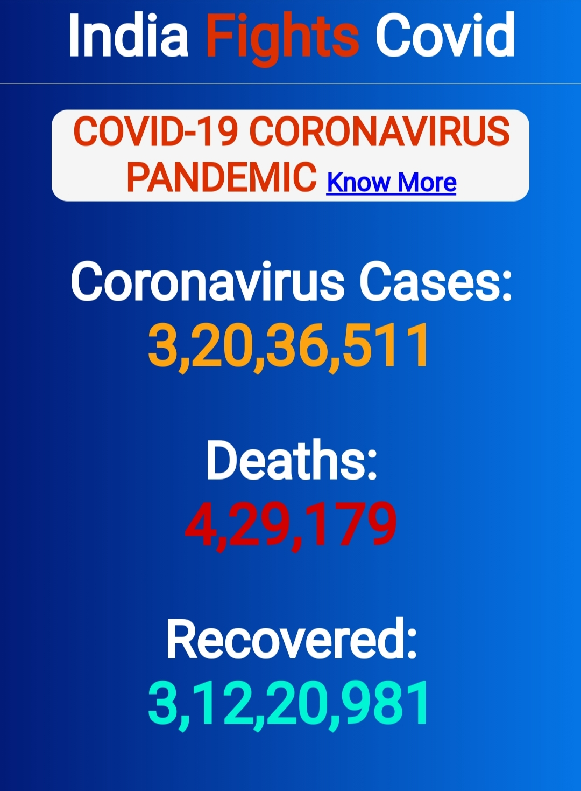
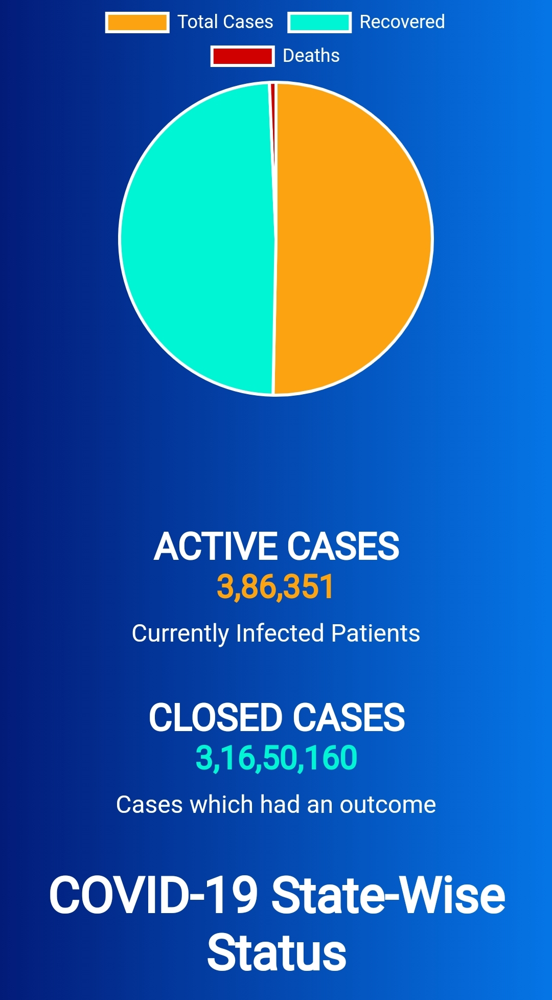
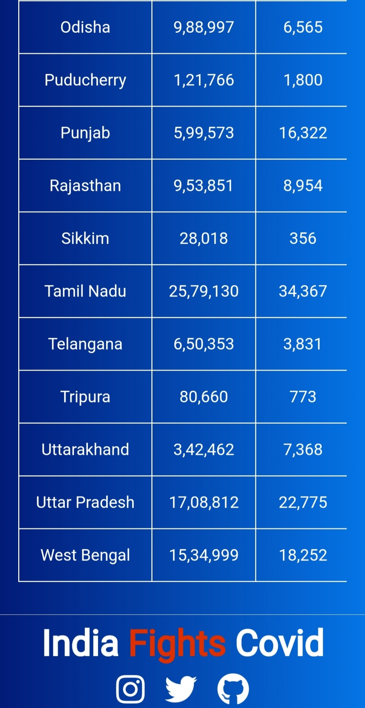
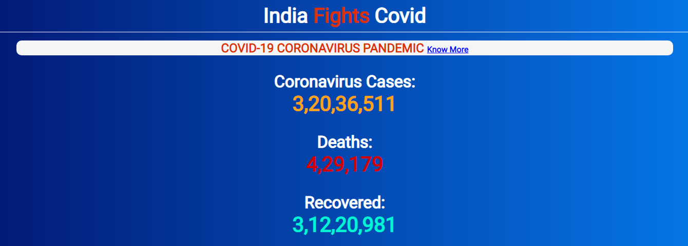
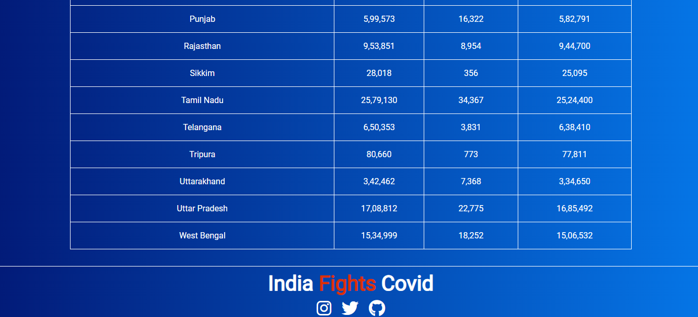

# IndisFightsCovid

Covid Cases Tracker Web App For India...

Project is Live on:-
https://indiafightscovid.netlify.app

API used in this project:-

1. https://api.rootnet.in/

## Screenshot :-

  

 

## Technologies Used :-

1. HTML
2. CSS
3. SASS
4. Javascript
